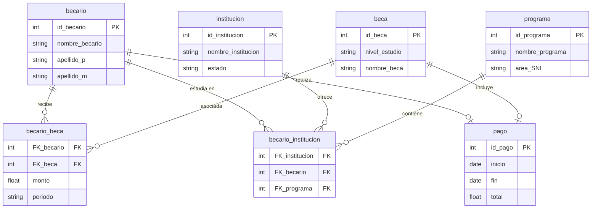

# Base de Datos Becarios
# Diagrama E-R

# Diagrama Relacional

```mermaid
erDiagram

    becario {
        int id_becario PK
        string nombre_becario
        string apellido_p
        string apellido_m
    }

    beca {
        int id_beca PK
        string nivel_estudio
        string nombre_beca
    }

    programa {
        int id_programa PK
        string nombre_programa
        string area_SNI
    }

    institucion {
        int id_institucion PK
        string nombre_institucion
        string estado
    }

    becario_institucion {
        int FK_institucion FK
        int FK_becario FK
        int FK_programa FK
    }

    becario_beca {
        int FK_becario FK
        int FK_beca FK
        float monto
        string periodo
    }

    pago {
        int id_pago PK
        date inicio
        date fin
        float total
    }

    becario ||--o{ becario_beca : "recibe"
    beca ||--o{ becario_beca : "asociada"
    becario ||--o{ becario_institucion : "estudia en"
    institucion ||--o{ becario_institucion : "ofrece"
    programa ||--o{ becario_institucion : "contiene"
    becario ||--o| pago : "realiza"
    beca ||--o| pago : "incluye"
```

